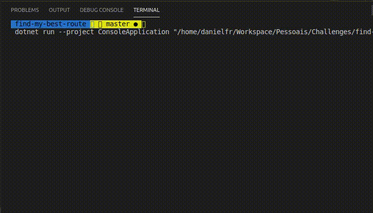

# Tech Challenge - find-my-best-route

## Solution overview


## Running the Console application
#### * ensure that the file path is correct

```
dotnet run --project ConsoleApplication "C:\Resources\input-file.txt"
```


## Running the Web API
#### * ensure that the file path is correct

```
dotnet run --project Api/Api.csproj
```

#### Web API urls
```
http://localhost:5000
https://localhost:5001
```

#### API Documentation (generated by swagger)

```
https://localhost:5001/index.html
http://localhost:5000/index.html
```

## Request examples
#### Add new routes (POST)
##### expect a list with one or more routes to be added
```
curl -X POST "https://localhost:5001/Route?filePath=Resources/input-file.txt" -H "accept: */*" -H "Content-Type: application/json" -d "[{\"from\":\"bhz\",\"to\":\"bru\",\"price\":10}]"
```

#### Get the Best Route between two points (GET)
```
curl -X GET "https://localhost:5001/Route/bhz/bru?filePath=Resources/input-file.txt" -H "accept: text/plain"
```
##### response example
```
Best route: BHZ - BRU > $10
```
## Running tests

### Unit tests 
#### testing Services and Infrastructure layers

```
dotnet test
```


## Continuous integration 
### GitHub Actions
```
.github/workflows/dotnet-core.yml
```


## Built With
* .NET Core 3.1
* C#
* GitHub
* Swagger
* Ubuntu 18.3
* Visual Studio Code